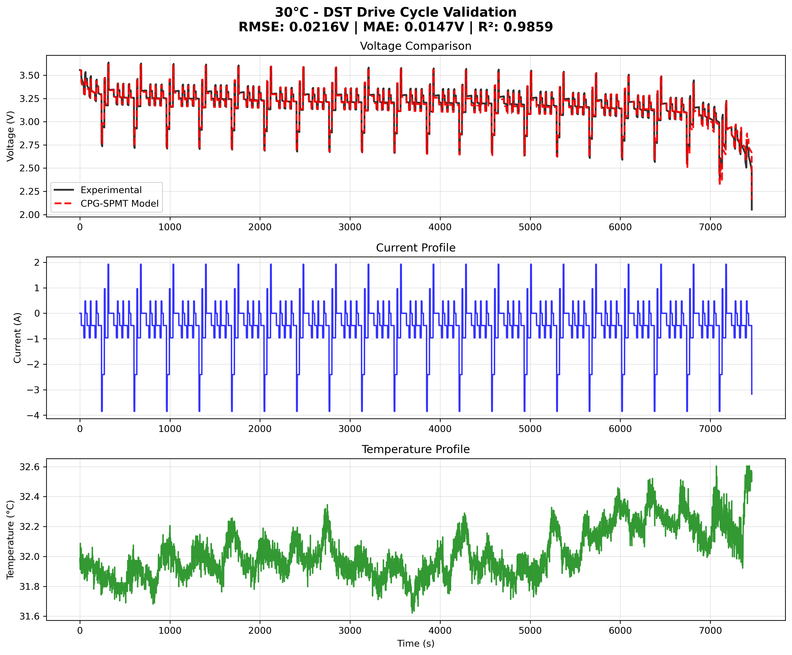

# CPG-SPMT: Control-oriented Parameter-Grouped Single Particle Model with Thermal effects
<!-- markdownlint-disable first-line-h1 -->
<!-- markdownlint-disable html -->
<!-- markdownlint-disable no-duplicate-header -->

<div align="center">
  
</div>

<div align="center" style="line-height: 1.5;">
  <a href="#"></a>
  <a href="#"></a>
  <a href="#"></a>
  <a href="#"></a>
  <a href="#"></a>
</div>


---

## 📋 Table of Contents

1. [Overview](#overview)
2. [Core Features](#core-features)
3. [Project Structure](#-project-structure)
4. [Installation Requirements](#-installation-requirements)
5. [Usage Guide](#-usage-guide)
6. [Model Validation](#-model-validation)
7. [Validation Results](#-validation-results)
8. [Battery Data Source](#-battery-data-source)
9. [File Descriptions](#-file-descriptions)
10. [Citation](#-citation)
11. [License](#-license)
12. [Contact](#-contact)

---

## Overview

The **CPG-SPMT: Control-oriented Parameter-Grouped Single Particle Model with Thermal effects** uses a **Padé approximation method** to discretize the SPM's governing PDE, thereby transforming the PDE into a set of ordinary differential equations (ODEs) that can be efficiently integrated over time. This approach reduces computational complexity while preserving the essential dynamics of the battery. Furthermore, the model applies **battery parameter grouping**, reducing the number of required parameters while maintaining accuracy. The model is designed to be both **observable** and **controllable**, which is crucial for applications in **battery state estimation** and **control design** within advanced battery management systems.


### Core features

- **PDE Discretization with Parabolic Approximation:**  
  The **parabolic approximation method** is used to discretize the PDE that describes lithium diffusion in the electrode, converting it into a tractable **state-space model**.

- **Battery Parameter Grouping:**  
  The model groups related parameters, reducing the number of independent parameters required while maintaining accuracy in simulations. The CPG-SPMT model uses **14 parameters total**:
  
  **9 Core SPM Parameters:**
  - `a_n_1`, `a_p_1`: Negative and positive electrode reference parameters
  - `b_n`, `b_p`: Negative and positive electrode time constants  
  - `d_n_1`, `d_p_1`: Negative and positive electrode reference diffusion parameters
  - `soc_n`, `soc_p`: Initial negative and positive electrode SOC values
  - `R_ini_1`: Reference internal resistance
  
  **5 Temperature-dependent Parameters (Activation Energies):**
  - `E_1`, `E_2`: Activation energies for negative and positive electrode kinetics
  - `E_3`, `E_4`: Activation energies for negative and positive electrode diffusion
  - `E_5`: Activation energy for internal resistance

- **Battery Simulation:**  
  The model computes the **terminal voltage response** based on **two input profiles: current (A) and temperature (°C)**, making it suitable for simulating battery behavior under various operating conditions and thermal environments.

- **State Estimation and Control:**  
  The **observable** and **controllable** structure of the model enables its use for **real-time battery state estimation** and **control**, serving as a solid foundation for the design of **battery management systems (BMS)**.

---

## 📁 Project Structure

```
SPM/
├── cpg_spmt.py                    # Core model implementation
├── model_validation.py            # Model validation script
├── README.md                      # Project documentation
├── cpg_spmt_logo.png              # Project logo
├── Apache_License.md              # Apache 2.0 open source license
├── data/                          # Experimental data
│   ├── A1-007-DST-US06-FUDS-N10-20120829_modified.xlsx  # -10°C data
│   ├── A1-007-DST-US06-FUDS-0-20120813_modified.xlsx    # 0°C data
│   ├── A1-007-DST-US06-FUDS-10-20120815_modified.xlsx   # 10°C data
│   ├── A1-007-DST-US06-FUDS-20-20120817_modified.xlsx   # 20°C data
│   ├── A1-007-DST-US06-FUDS-25-20120827_modified.xlsx   # 25°C data
│   ├── A1-007-DST-US06-FUDS-30-20120820_modified.xlsx   # 30°C data
│   ├── A1-007-DST-US06-FUDS-40-20120822_modified.xlsx   # 40°C data
│   └── A1-007-DST-US06-FUDS-50-20120824_modified.xlsx   # 50°C data
└── validation_results/            # Validation results
    ├── *C_*_validation.png        # 24 individual validation plots (including 30C_DST_validation.png for Figure 1)
    ├── error_distribution_analysis.png     # Error distribution analysis (Figure 2)
    ├── validation_summary_comparison.png   # Validation results comparison
    ├── cpg_spmt_validation_results.csv     # Main validation results
    └── detailed_validation_errors.csv      # Detailed error data
```

---

## 🛠️ Installation Requirements

### System Requirements
- Python 3.7+
- Operating System: Windows, macOS, Linux

### Dependencies
```bash
pip install numpy scipy matplotlib pandas openpyxl
```

### Detailed Dependencies
- **numpy**: Numerical computation and array operations
- **scipy**: Scientific computing and signal processing
- **matplotlib**: Data visualization and plotting
- **pandas**: Data processing and analysis
- **openpyxl**: Excel file reading

---

## 🚀 Usage Guide

### 1. Basic Usage with Experimental Data Validation

This example demonstrates model validation using 30°C DST (Dynamic Stress Test) data, which represents excellent model performance with RMSE = 0.0216V and R² = 0.9859. The model takes **current profile (A)** and **temperature profile (°C)** as inputs and outputs **voltage response (V)**. 

> **📖 Note**: If you use this model in your research, please [cite the related publications](#-citation).

```python
from cpg_spmt import cpg_spmt
import numpy as np
import pandas as pd
import matplotlib.pyplot as plt

# Load experimental data (30°C DST driving cycle)
data_file = "data/A1-007-DST-US06-FUDS-30-20120820_modified.xlsx"
exp_data = pd.read_excel(data_file, sheet_name="DST")

# Extract experimental data
time_exp = np.array(exp_data["Test_Time(s)"].tolist())
current_exp = np.array(exp_data["Current(A)"].tolist())
voltage_exp = np.array(exp_data["Voltage(V)"].tolist())
temperature_exp = np.array(exp_data["Temperature (C)_1"].tolist())

# Normalize time to start from zero
time_exp = time_exp - time_exp[0]

# Run CPG-SPMT model simulation
voltage_sim = cpg_spmt(current_exp, temperature_exp)

# Calculate validation metrics
rmse = np.sqrt(np.mean((voltage_exp - voltage_sim) ** 2))
mae = np.mean(np.abs(voltage_exp - voltage_sim))
r_squared = 1 - np.sum((voltage_exp - voltage_sim) ** 2) / np.sum((voltage_exp - np.mean(voltage_exp)) ** 2)

print(f"🔋 CPG-SPMT Model Validation Results (30°C DST)")
print(f"📊 Test Duration: {time_exp[-1]:.0f} seconds ({time_exp[-1]/3600:.1f} hours)")
print(f"📈 RMSE: {rmse:.4f} V")
print(f"📉 MAE:  {mae:.4f} V") 
print(f"📊 R²:   {r_squared:.4f}")
print(f"⚡ Voltage Range - Exp: {voltage_exp.min():.3f}V - {voltage_exp.max():.3f}V")
print(f"🔮 Voltage Range - Sim: {voltage_sim.min():.3f}V - {voltage_sim.max():.3f}V")

# Plot comparison with three subplots
plt.figure(figsize=(14, 10))

# Voltage comparison
plt.subplot(3, 1, 1)
plt.plot(time_exp/3600, voltage_exp, 'k-', label='Experimental', linewidth=1.5, alpha=0.8)
plt.plot(time_exp/3600, voltage_sim, 'r--', label='CPG-SPMT Model', linewidth=1.5)
plt.ylabel('Voltage (V)')
plt.title(f'30°C DST Validation - RMSE: {rmse:.4f}V, MAE: {mae:.4f}V, R²: {r_squared:.4f}')
plt.legend()
plt.grid(True, alpha=0.3)

# Current profile
plt.subplot(3, 1, 2)
plt.plot(time_exp/3600, current_exp, 'b-', linewidth=1.5)
plt.ylabel('Current (A)')
plt.title('DST Current Profile')
plt.grid(True, alpha=0.3)

# Temperature profile
plt.subplot(3, 1, 3)
plt.plot(time_exp/3600, temperature_exp, 'g-', linewidth=1.5)
plt.xlabel('Time (hours)')
plt.ylabel('Temperature (°C)')
plt.title('Temperature Profile')
plt.grid(True, alpha=0.3)

plt.tight_layout()
plt.savefig('readme_basic_usage_example.png', dpi=300, bbox_inches='tight')
plt.show()
```

**Expected Output:**

<div align="center">
  
  <p><em>Figure 1: CPG-SPMT Model Validation using 30°C DST Data</em></p>
</div>

The plot shows excellent agreement between experimental and simulated voltage (top), along with the DST current profile (middle) and temperature variations (bottom). The validation achieves RMSE = 0.0216V, MAE = 0.0147V, and R² = 0.9859.

### 2. Custom Parameters

```python
# Custom model parameters
custom_params = {
    'a_n_1': 2.0,      # Negative electrode diffusion parameter
    'a_p_1': 2.0,      # Positive electrode diffusion parameter
    'd_n_1': 1.0e-14,  # Negative electrode diffusion coefficient
    'd_p_1': 1.0e-14,  # Positive electrode diffusion coefficient
    'R_ini_1': 0.01,   # Initial internal resistance
    # ... other parameters
}

# Run model with custom parameters
voltage = cpg_spmt(current, temperature, param=custom_params)
```

### 3. Run Complete Validation

```bash
# Run model validation script
python model_validation.py
```

The validation script will:
- 🔄 Process all temperature conditions (-10°C to 50°C)
- 📊 Generate 24 individual validation plots
- 📈 Create error distribution analysis plots
- 💾 Save all results to `validation_results/` folder

---

## 🔬 Model Validation

### Validation Dataset
- **Data Source**: A1-007 lithium-ion battery experimental data
- **Temperature Range**: -10°C, 0°C, 10°C, 20°C, 25°C, 30°C, 40°C, 50°C
- **Driving Cycles**: DST, US06, FUDS
- **Total Test Conditions**: 24 (8 temperatures × 3 conditions)

### Validation Metrics
- **RMSE** (Root Mean Square Error): Voltage prediction accuracy
- **MAE** (Mean Absolute Error): Mean absolute error
- **R²** (Coefficient of Determination): Correlation coefficient


---

## 📊 Validation Results

### 🎯 Overall Performance
- **✅ Excellent Accuracy**: Average RMSE = 0.0331V (< 0.05V)
- **📈 High Correlation**: Average R² = 0.9683 (> 0.96)
- **🎪 Low Error Rate**: Average MAE = 0.0218V
- **🌡️ Full Temperature Range**: Stable performance from -10°C to 50°C


### 📊 Comprehensive Validation Results

<div align="center">
  
  <p><em>Figure 2: CPG-SPMT Model Error Distribution Analysis Across All Temperature and Drive Cycle Conditions</em></p>
</div>

The error distribution analysis shows consistent performance across different temperatures and drive cycles, with excellent R² values (>0.96) and low RMSE values (<0.07V) throughout the entire operating range. The histograms demonstrate that most validation cases achieve very low errors, with mean RMSE = 0.0331V and mean MAE = 0.0218V.

---

## 🔋 Battery Data Source

The experimental validation data used in this project is sourced from the **University of Maryland Battery Laboratory (CALCE)**.

### Data Source Information
- **Institution**: [CALCE Battery Research Group, University of Maryland](https://calce.umd.edu/battery-data)


### Battery Specifications (A123 Reference)
Based on the CALCE database,  A123 battery specifications include:

| **Battery Parameter**    | **Specification**     |
| ------------------------ | --------------------- |
| **Capacity Rating**     | 1100 mAh             |
| **Cell Chemistry**      | LiFePO4              |
| **Diameter**            | 18 mm                |
| **Length**              | 65 mm                |


---

## 📄 File Descriptions

### Core Files

#### `cpg_spmt.py`
Main model implementation file containing:
- `cpg_spmt()`: Main simulation function
- `ocp_pos()`, `ocp_neg()`: Positive and negative electrode OCV functions
- `update_temperature_dependent_parameters()`: Temperature parameter updates
- `build_state_space_matrices()`: State-space matrix construction

#### `model_validation.py`
Model validation script with features:
- Experimental data loading and preprocessing
- Model simulation and error calculation
- Results visualization and report generation
- Batch validation processing

### Data Files

#### `data/` Folder
Contains 8 Excel files, each corresponding to one temperature condition:
- Each file contains DST, US06, FUDS worksheets
- Data columns: Time, Voltage, Current, Temperature
- Data preprocessed and quality checked

#### `validation_results/` Folder
Validation results output folder:
- **Individual plots**: 24 PNG images, one per condition
- **Summary plots**: Error distribution analysis and comparison plots
- **Data files**: CSV format validation results and detailed data

---

## 📚 Citation

If you use this model in your research or projects, please cite the following papers:

**Primary Reference:**
> Guo, Feng, and Luis D. Couto. "A control-oriented simplified Single Particle Model with grouped parameter and sensitivity analysis for lithium-ion batteries." *Journal of Power Sources* 649 (2025): 237309.

**Numerical Method Reference:**
> Guo, Feng, and Luis D. Couto. "Comparative performance analysis of numerical discretization methods for electrochemical model of lithium-ion batteries." *Journal of Power Sources* 650 (2025): 237365.

**BibTeX Format:**
```bibtex
@article{guo2025cpg,
  title={A control-oriented simplified Single Particle Model with grouped parameter and sensitivity analysis for lithium-ion batteries},
  author={Guo, Feng and Couto, Luis D.},
  journal={Journal of Power Sources},
  volume={649},
  pages={237309},
  year={2025},
  publisher={Elsevier}
}

@article{guo2025comparative,
  title={Comparative performance analysis of numerical discretization methods for electrochemical model of lithium-ion batteries},
  author={Guo, Feng and Couto, Luis D.},
  journal={Journal of Power Sources},
  volume={650},
  pages={237365},
  year={2025},
  publisher={Elsevier}
}
```


---

## 📜 License

This project is released under the **[Apache License 2.0](Apache_License.md)**.

### License Highlights
- ✅ Commercial use
- ✅ Modification and distribution
- ✅ Private use
- ✅ Patent protection
- ✅ Trademark protection
- ❗ Copyright notice required
- ❗ License notice required
- ❗ State changes required
- ❗ No warranty provided

---

## 📧 Contact

**Author**: Feng Guo  

**Email**: feng.guo [at] vito [dot] be  

**Institution**: VITO (Flemish Institute for Technological Research)

### Technical Support
- 🐛 Bug reports: Please contact via email
- 💡 Feature suggestions: Welcome improvement suggestions
- 🤝 Collaboration opportunities: Open to academic and industrial partnerships
- 📖 **Academic Use**: Please remember to [cite our publications](#-citation) when using this model

---

<div align="center">
  <p><strong>🔋 Making Battery Modeling Simpler, Energy Management Smarter!</strong></p>
  <p><em>CPG-SPMT © 2025 Feng Guo. All rights reserved.</em></p>
</div>